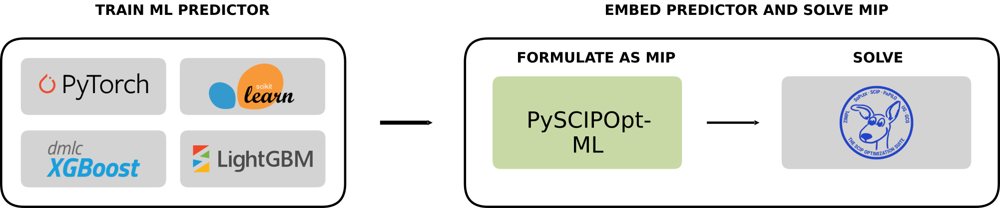

[](https://github.com/psf/black)
[](https://pypi.org/project/pyscipopt-ml)



# PySCIPOpt-ML

PySCIPOpt-ML is a python interface to automatically formulate Machine Learning (ML) models into Mixed-Integer Programs (MIPs).
PySCIPOPT-ML allows users to easily optimise MIPs with embedded ML constraints.

The package currently supports various ML objects from [Scikit-Learn](https://scikit-learn.org/stable/),
[XGBoost](https://xgboost.readthedocs.io/en/stable/), [LightGBM](https://lightgbm.readthedocs.io/en/stable/),
[PyTorch](https://pytorch.org/), [Keras](https://keras.io/), and [ONNX](https://onnx.ai/).

# Documentation

The latest user manual is available on [readthedocs](https://pyscipopt-ml.readthedocs.io/).

# Contact us

For reporting bugs, issues and feature requests please
[open an issue](https://github.com/Opt-Mucca/PySCIPOpt-ML/issues).

# Installation

## Dependencies

`pyscipopt-ml` requires the following:
- Python >= 3.8
- [`numpy`](https://pypi.org/project/numpy/) >= 1.23.0
- [`pyscipopt`](https://pypi.org/project/pyscipopt/) >= 4.4.0

The current version supports the following ML packages:
- [`torch`](https://pypi.org/project/torch/)
- [`keras`](https://pypi.org/project/tensorflow/)
- [`scikit-learn`](https://pypi.org/project/scikit-learn)
- [`XGBoost`](https://pypi.org/project/xgboost/)
- [`LightGBM`](https://pypi.org/project/lightgbm/)
- [`onnx`](https://pypi.org/project/onnx/)

Installing these packages is only required if the predictor you want to insert uses them
(i.e. to insert a XGBoost based predictor you need to have `xgboost` installed).

## Pip installation

The easiest way to install `PySCIPOpt-ML` is using `pip`.
It is recommended to always install packages in a virtual environment:
```shell
(venv) pip install pyscipopt-ml
```
This will also install the `numpy` and `pyscipopt` dependencies.

## Installation from source

An alternative way to install `PySCIPOpt-ML` is from source. First this repository
needs to be cloned. This can be achieved via HTTPS with:
```shell
git clone https://github.com/Opt-Mucca/PySCIPOpt-ML/
```
and SHH with
```shell
git clone git@github.com:Opt-Mucca/PySCIPOpt-ML.git
```

After cloning the repository entering the directory where it was cloned, one can run the command:
```shell
(venv) python -m pip install .
```

# Development
This project is completely open to any contributions. Feel free to implement your own functionalities.

Before committing anything, please install pytest, pre-commit, and all ML frameworks:

```shell
pip install pytest
pip install scikit-learn
pip install torch
pip install tensorflow
pip install xgboost
pip install lightgbm
pip install onnx
pip install onnxruntime
pip install pre-commit
pre-commit install
```

## Source code
You can clone the latest sources with the command:
```shell
git clone git@github.com:Opt-Mucca/PySCIPOpt-ML.git
```

## Documentation
You can build the documentation locally with the command
```shell
pip install -r docs/requirements.txt
sphinx-build docs docs/_build
```
Às the documentation requires additional python packages, one should run the following command
before building the documentation for the first time:
```shell
(venv) pip install -r docs/requirements.txt
```

## Testing
After cloning the project, you can run the tests by invoking `pytest`. For this, you will need to create a virtual
environment and activate it. Please also make sure to append your python path:
```shell
python -m venv venv
source venv/bin/activate
export PYTHONPATH="$(pwd):${PYTHONPATH}"
```
Then, you can install `pytest` and run a few basic tests:
```shell
(venv) pip install pytest
(venv) pytest
```

## How to cite this work

If this software was used for academic purposes, please cite our paper with the below information:

```
@article{turner2023pyscipopt,
  title={PySCIPOpt-ML: Embedding Trained Machine Learning Models into Mixed-Integer Programs},
  author={Turner, Mark and Chmiela, Antonia and Koch, Thorsten and Winkler, Michael},
  journal={arXiv preprint arXiv:2312.08074},
  year={2023}
}
```

## Funding Acknowledgements

The work for this article has been conducted in the Research Campus MODAL
funded by the German Federal Ministry of Education and Research (BMBF)
(fund numbers 05M14ZAM, 05M20ZBM).
